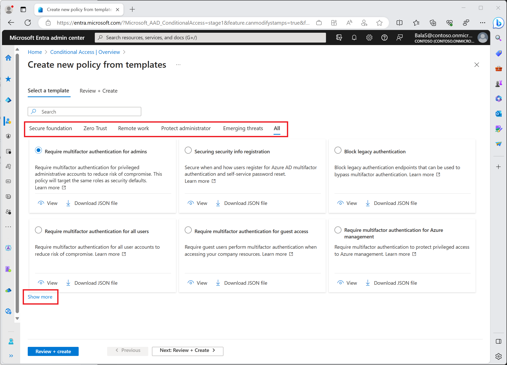

# entra_conditional_access_as_code
This project implements Microsoft Entra Conditional Access policies with Terraform. It parses a list of file names, reads the associated json file and applies the specified policy configuration.

The sample policies are based on included [Conditional Access policy templates](https://learn.microsoft.com/en-us/entra/identity/conditional-access/concept-conditional-access-policy-common?tabs=secure-foundation).



Any referenced role and group ID's are built-in constants across all Azure tenancies.

```json
    "conditions": {
        "clientAppTypes": ["all"],
        "applications": {
            "includeApplications": ["All"]
        },
        "users": {
            "excludeUsers": ["<BREAK-GLASS-ACCOUNT-ID>"],
            "includeRoles": [
                "62e90394-69f5-4237-9190-012177145e10", "194ae4cb-b126-40b2-bd5b-6091b380977d", 
                "f28a1f50-f6e7-4571-818b-6a12f2af6b6c", "29232cdf-9323-42fd-ade2-1d097af3e4de", 
                "b1be1c3e-b65d-4f19-8427-f6fa0d97feb9", "729827e3-9c14-49f7-bb1b-9608f156bbb8", 
                "b0f54661-2d74-4c50-afa3-1ec803f12efe", "fe930be7-5e62-47db-91af-98c3a49a38b1", 
                "c4e39bd9-1100-46d3-8c65-fb160da0071f", "9b895d92-2cd3-44c7-9d02-a6ac2d5ea5c3", 
                "158c047a-c907-4556-b7ef-446551a6b5f7", "966707d0-3269-4727-9be2-8c3a10f19b9d", 
                "7be44c8a-adaf-4e2a-84d6-ab2649e08a13", "e8611ab8-c189-46e8-94e1-60213ab1f814"
            ]
        }
    },
```

Please also note the *"<BREAK-GLASS-ACCOUNT-ID\>"* in each policy - as per best practice to ensure you do not lock yourself out, please populate this accordingly.

## 'exceptions' Folder

Two sample policies require evaluation **everytime**, there is a known issue [#1416](https://github.com/hashicorp/terraform-provider-azuread/issues/1416) with the Terraform **azurerm** provider *(actually it is upstream with the Microsoft API however we can't track that resolution)* which would consistently require the policy to be changed following a `terraform plan` however as the API does not currently expose the attribute each **plan** operation would effectively fail from a compliance perspective. To work around this I implemented an alternate method to create the policy directly within Microsoft Graph via a REST API call.

Given the increased change and focus Microsoft have been putting on Entra Conditional Access policies in recent months with new functionality and preview feature sets I believe this alternate method will see reasonable utilization in your compliance toolset moving forward. My thoughts being that newer policies can be deployed prior to their support in the official Terraform provider. Similarly the code could be trivially extended to push beta policies via the [beta Microsoft Graph endpoint](https://graph.microsoft.com/beta)

It was because of the current provider limitations I chose to align the json format to that required by the Graph API. This ensured that as features became available the configuration file could simply be transferred from the **exceptions** library to the standard **lib**.

When pushing the json file directly via the API it does not fault the inclusion of additional fields. I thus created the **Tracking_Data** field. 

```json
{
    "Tracking_Data": {
        "purpose": "IaC_cap_009 - Require multifactor authentication for risky sign-ins",
        "serviceRequestNumber": "SR123789"
    },
    "displayName": "IaC_cap_009 - Require multifactor authentication for risky sign-ins",
    ...
}
```

This field is not currently referenced in the code and can be renamed to align with your organisational standards. Similarly the 'Key - Value' pairs within can be omitted or aligned with appropriate data for your records.

## Deployment
This project was deployed via Azure DevOps. The (Continuous Integration) CI pipeline file used is included for reference (it could be tidied up somewhat). An artifact is created by the pipeline and stored for usage in a release pipeline. The following **case-sensitive** variables must be set in the relevant variable group:

- ARM_SAS_TOKEN
- ARM_SUBSCRIPTION_ID
- backendAzureRmContainerName
- backendAzureRmKey
- backendAzureRmResourceGroupName
- backendAzureRmStorageAccountName
- env
- plan_file
- svc_connection

In a Continuous Deployment (CD) scenario the release pipeline then takes the artifact and displays the output of the `terraform plan` command. An email might then be sent to a relevant authority seeking approval for the deployment which may be scheduled appropriately. A `terraform apply` command is then run against the approved **tfplan** file. 

I will document a generalised process and link it here in the next few days.

## Known Issues

- Currently removing policies deployed via the **exception** method is not supported. These can be manually removed via the Portal or via direct REST calls as illustrated in the sample code that has been commented out. See proposed future work below.
- In some circumstance, generally when a large number of policies are being deployed the API can be overwhelmed and your `terraform apply` may fail due to API limits. Either stagger the initial population of your policy deployment or re-run your CI pipeline to generate a fresh plan including what has been deployed and let it trigger your CD release pipeline.

## Future Work
1. The Entra Conditional Access Policies created via the Microsoft Graph API call do not tear down very well. The current implementation treats them as an ordered array so removing one of the elements from **local.exception_policy_files** causes alignment issues. Given the small number of affected policies and the project being more of a PoC I did not get an opportunity to make the code as resilient as I would have liked. My thoughts were along the lines of searching for the policy within Microsoft Graph and based on the presence or absence of the expected array element deleting the policy that was removed or validating the configured settings aligned with the saved (in your repository) json configuration.

2. There are several elements that are currently supported within the existing **azuread_conditional_access_policy** Terraform provider that I have not had the use case to complete.:

- excluded_guests_or_external_users
- included_guests_or_external_users

  The sections were commented out within the resource to easily call out their absence and the overall syntax structure. With an appropriate reference file this should not be overly complex to complete.

3. I'd like to re-organise the code slightly and move the main components to seperate sub-modules folders. This would make the root **./main.tf** file easier to read and simplify the testing of the 2 points above by removing any requirement to comment out large sections of code.
